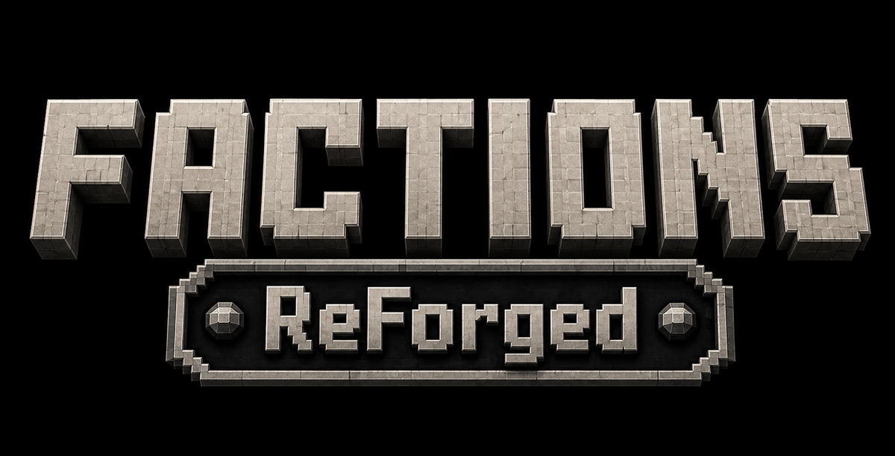

Land, allegiance, and the people you hold it with.

Inspired by [MassiveCraft's Factions](https://github.com/MassiveCraft/Factions), which is where
most people's mental model of this comes from. **Not a port of it** — the original is a decade of
Bukkit, and the interesting parts of the idea deserve a modern implementation rather than a
faithful one.

Requires **[SableCraft Standards](../SableCraft-Standards)**, and not optionally.

## What it does

```
/f create <name>         found one
/f invite <player>       officer+
/f join <name>           take an invitation
/f request <name>        ask to be let in
/f requests              who is waiting, officer+
/f accept | decline      answer one
/f claim | unclaim       the chunk you are stood in
/f autoclaim             take every chunk you walk into, until it runs out
/f sethome | home        on your own land, with Standards' warmup and safe landing
/f ally|enemy|neutral    declare towards another faction
/f peaceful              opt out of fighting entirely
/f tag SBL               the short label chat uses
/f map [item [zoom]]     see below
/f borders               show the edges
/f status                where you stand with everybody
/f chat [public|faction|ally]   or cycle with no argument
/f c <message>           one line to your faction, without switching
/f ca <message>          one line to your allies
/f money [deposit|withdraw|pay] the faction bank
/f who <name> | list
```

## Three things worth the read

### The map is a real map

A vanilla map's scale sets how many blocks each pixel covers: `1 << scale`. At the maximum scale of
4 that is sixteen blocks — **exactly one chunk per pixel**. A fully zoomed-out vanilla map is
already a 128×128 chunk grid with its pixels on chunk boundaries, which is precisely the shape a
claims map wants and is not something anybody designed on purpose.

So `/f map item` hands you an ordinary `filled_map` that we painted: green yours, blue allied, red
hostile, white everyone else, black wilderness. It is **locked**, the way a cartography table locks
one, so vanilla does not slowly repaint it with terrain as you walk.

The four brightness levels each map colour has are spent on **edges** — a chunk with a
differently-owned neighbour is drawn bright, the interior dim. A field of flat colour becomes an
outlined territory you can read the shape of.

An unmodded client renders all of this. The server owns the pixels and sends them; there is no
client mod, no resource pack and no rendering code.

`/f map item <zoom>` trades coverage for detail in exact steps, because a pixel covers
`1 << scale` blocks and there is nothing in between: **2** pixels per chunk shows 64 chunks, **4**
shows 32, **8** shows 16. One is the default and stays right for a busy world, but a server whose
factions hold a handful of chunks each is lost on the wide view. `map.pixelsPerChunk` sets what you
get without asking.

The edge test is per **pixel**, not per chunk — otherwise the outline would thicken with the zoom
until a small territory was solid highlight.

`/f map` on its own gives the classic chat grid, for when you have no hands free.

### Borders are only drawn where they are borders

The obvious implementation outlines every chunk and produces a grid, which tells you where chunks
are — something you already knew. Each side is drawn only when the chunk beyond it has a different
owner, so interior lines vanish and what is left is the outline of the territory.

Coloured by **relation, not identity**: colouring by faction would need a legend and a good memory,
while colouring by what it means to you needs neither, and is the only question you are asking when
you walk up to a line.

They **stand on the ground**, not at your feet. Drawn at a flat height the wall is buried in the
first hill it crosses and floating over the first valley — and being underground is worst at the
exact moment you are walking over the line, which is the one moment the display exists for. Each
column samples the surface beneath it, clamped to a window around you so a border running off a
cliff does not spend its particles out of sight, and only where the chunk is already loaded:
drawing a decoration is no reason to generate terrain.

The floor row draws every block and the row above it every second one. They are doing different
jobs — the floor row *is* the line, read at a glance and a shallow angle, where a gap every other
block is a dashed line rather than a border; the upper row only has to say "wall".

Two ways to see them: `/f borders` for surveying, or just **hold the tool** — a compass by default.
Pick it up, see what you are doing, put it down. The same shape as vanilla's debug stick, and
nobody leaves it on and forgets why their screen is full of dust.

### Protection is about right-clicks, not just pickaxes

Guarding block-breaking alone protects the walls and leaves everything behind them open. A stranger
who cannot mine your chest can still **open** it, which is the theft the claim was bought to
prevent — and flip your levers, open your doors and empty your furnaces on the way out. So
right-clicking a block in somebody's claim does nothing at all.

Deliberately not a list of protected materials. A list is something somebody has to maintain, and
every modded block is missing from it by default; the original shipped exactly such a list — door,
trapdoor, chest, furnace, dispenser, repeater — and it was already incomplete for vanilla by the
time anyone read it. Item frames, armour stands and paintings are covered separately, because none
of them are blocks and every block-shaped guard misses them.

**Explosions stop at the fence**, and the list of affected blocks is *filtered* rather than the
explosion being cancelled — a creeper on the wilderness side of your wall should crater the
wilderness and leave the wall standing. Entities are untouched: standing next to a creeper in your
own base is still a mistake, and a claim that made its owners bomb-proof would be a PvP mechanic
smuggled in as a building one. Every block is judged by the chunk it sits in and never by who lit
the fuse, so throwing TNT in from outside buys a raider nothing.

**Placing is building; landing is not.** The place guard is absolute whatever `blockTnt` says — you
may never put a block down in somebody's claim, TNT included. So with TNT allowed, the way through
a wall is to *deliver* a charge rather than to stand there and stack it: primed TNT flung over the
border by a second charge is a moving entity, and where it lands is governed by `blockTnt` alone.

That is the 2012 raiding meta arriving without anyone designing it, and it is worth keeping on
purpose. Anybody can walk up to a wall with a stack; building something that lobs a charge over it
is a different evening, so a siege stays a skill rather than a formality.

`blockTnt` is the one genuine choice there. On a PvP faction server **TNT is the raid tool** — it is
how a siege gets through a wall, and disabling it means a well-built base can never be taken. On a
PvE or build server it is purely how somebody erases your evening. It defaults to on because this
is a PvE-leaning mod; a war server should turn it off and expect cannons.

**`anyoneMayRotateFrames`** is worth knowing about, because the right answer differs by server.
Turning a frame that already holds something takes nothing and changes nothing that cannot be
turned back — but it is unmistakable evidence somebody stood there. On a build server that is petty
griefing of your sorting labels; on a roleplay server it is a calling card, a way to say *I was
here* that breaks nothing and starts wars. Off by default, and taking the item is refused either
way.

**Pressure plates still work**, because standing on one is not a right-click. A landowner who wants
visitors puts a plate outside the door — protection you can deliberately open a hole in beats
protection you have to switch off. That trick is as old as the plugin and still the right answer.

Allies may **interact** by default and may **not build** by default, and the split is on purpose.
An ally who cannot open your gate stands outside it; an ally who can take your walls down is a
demolition permit you issued for a diplomatic position that can change next week.

### Chat goes through Standards, not around it

Faction and ally channels are a `ChatRouter`, which is Standards' seam for exactly this, rather
than our own `ServerChatEvent` listener. The difference is not stylistic: a channel that cancels
the event itself runs *before* Standards' checks, so a muted player flips to faction chat and
talks — and a mute that silences only public chat is not a mute. Their AFK marker never clears
either, so they stay listed as away while holding a conversation.

`/ignore` deliberately does **not** apply here. The seam leaves that judgement to the channel, and
for a small opt-in one the answer is no: you chose to be in this faction and so did they. Silently
dropping a member's words inside their own faction chat produces a conversation where one person
is answering questions nobody else saw asked.

`/f c <message>` sends one line without moving house, which is most of what people actually want —
and it passes the same mute and AFK gates a typed line does, or it would be the hole that makes a
mute a suggestion.

### The bank is an account, not an economy

Standards' `Economy` facade decides who holds *player* money, and exactly one provider wins that:
a balance is a single fact and two ledgers disagreeing is worse than either. A faction balance is a
different question — it is a container, like a chest — so Factions stores it and moves money
through the facade. A server running a dedicated economy mod keeps it, and nothing here contests
that seam.

Every transfer is two halves against two ledgers, and the interesting case is the first succeeding
while the second fails. The fallible half always goes first and refunds if the second fails, so
the worst outcome is a no-op rather than money that stopped existing.

**Claims are paid by the faction, not the claimer**, which is what makes the bank something a
faction uses together rather than a shared piggy bank nobody touches. Prices rise with every chunk
held — a flat price means the largest faction, the one that needs land least, buys it most easily.
Refunds are priced at the position the chunk occupied rather than today's price, or a faction could
buy cheap while small, grow, and release the same chunk at a profit. Off by default
(`claimCost = 0`), so a server without an economy mod does not find claiming silently impossible.

### Status answers the questions nothing else will

An offered alliance is announced when it is made and never mentioned again. If you were offline, or
scrolled past it, the offer exists and nothing will tell you. The same is true of being declared
upon: you find out there is a war on by being killed in it. Everything else is available a faction
at a time through `/f who`, which requires knowing who to ask about — the thing you do not know.

So `/f status` puts it in one place, and **splits everything by direction**. An alliance offered
*to* you is a decision waiting on you; one offered *by* you is a thing you are waiting on. Sorting
both into a single "pending" list would hide which is which behind a name you have to recognise.

Enemies split the same way for a sharper reason: `relation()` resolves to hostile from one side's
declaration alone — that asymmetry is deliberate — so the relation itself cannot tell a war you
started from one started on you, and those want different responses.

### You can ask, not only be asked

An invite finds a specific person: an officer already knows who they want. A **request** is sent by
somebody who does not know anybody yet — which is exactly the player the invite flow cannot help.
Without `/f request`, joining a faction requires already being known to one: fine on a server of
twenty friends, useless to the person who logged in an hour ago and read a tag in chat.

It is shown to whoever can act on it, and only them. A request nobody sees is one that sits there
until the asker concludes the faction ignored them.

`requests.officersMayAccept` is on by default, because an officer can already `/f invite` whoever
they like — letting them recruit a stranger but not one who asked first is a rule nobody could
explain. Turn it off where the leader wants to vet every member personally.

Membership is checked again at the moment of acceptance rather than trusted from when the request
was made. The gap between asking and being answered is where somebody accepts an invitation
somewhere else.

### Autoclaim knows when to stop

Marking a base out one `/f claim` at a time is the tedious part of owning land: you know the shape
you want and you are already walking it. `/f autoclaim` makes the walk the claim.

The feature is the stopping, because that is what every version of this gets wrong. Running out of
land **switches it off** — the limit is not a chunk you happened to stand on, it is a state that
will refuse the next one too, and repeating that every sixteen blocks for an afternoon is how a
convenience becomes a nuisance. Walking through somebody else's territory says **nothing at all**;
that is a journey, not a failed claim, and the action bar already names whose land it is. A
standing reason is given **once**, not per chunk. And it is off when you log back in — a thing you
are doing, not a setting you have.

`/f claim` and `/f autoclaim` share one decision function. The day they disagreed about the claim
limit or the connectedness rule would be the day somebody walked a border into existence that the
command would have refused.

### Allies agree, enemies do not

Declaring an ally is a *wish*: two factions are allied only when both have said so, and the offer
is announced to the other side so it does not look like nothing happened. Declaring an enemy takes
effect immediately and alone.

You cannot conscript a friend, and you cannot decline to be somebody's target by not filing the
paperwork.

**Peaceful** is a faction-level declaration rather than a server config flag, so a co-operative
corner can exist on a server that otherwise fights. It holds in both directions: a peaceful faction
cannot declare enemies and cannot be declared upon.

## What it borrows

Standards is a hard dependency, and that is the architecture rather than a shortcut. Factions
publishes the two things it knows — who is allied with whom, and who owns this chunk — through
Standards' **groups** and **claims** seams, and takes everything else back:

| | from |
|---|---|
| chat tags | registering as a group kind; there is no chat code in this mod |
| homes, warmups, safe landings | Standards' teleports |
| every player-facing string | Standards' `messages.yml`, contributed at setup |

That last one means **one catalogue for the whole server**. Rename "faction" to "clan" in one file
and both mods follow.

To put faction tags in chat, add the kind to Standards' config:

```toml
groupTagKinds = ["factions:faction", "standards:group"]
```

Listed outermost-first, so a faction tag renders furthest from the name.

### The rule that keeps it honest

- **`api/`** — the seams. Swappable: an FTB Chunks bridge must be able to answer anything Factions
  can. If Factions needs a seam to grow, the seam is wrong and should grow.
- **`neoforge/`** — shared utilities. Fair game for a hard dependant; reimplementing them would
  give one player two different messages about the same cooldown. What it may not do is reach past
  a public method into internal state.

## Building

Its build is driven from the Standards project next door:

```bash
cd ../SableCraft-Standards
./gradlew :factions:build
./gradlew runServer          # loads both mods
```
